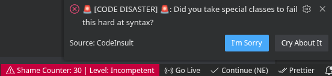
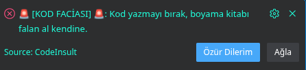
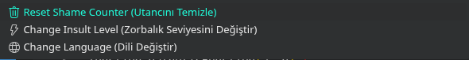
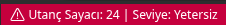

# 🤬 CodeInsult 🚨

  

  <b><i>"Because your code is a joke, and someone needs to tell you."</i></b>

  <a href="https://marketplace.visualstudio.com/items?itemName=Slecyx.code-insult">View on Visual Studio Marketplace</a>

  <a href="#english">English</a> • <a href="#turkish">Türkçe</a>

---

## 🇺🇸 English Version

**Stop failing. Or don't, I love watching you struggle.**

CodeInsult is a "savage" VS Code extension that replaces boring error markers with soul-crushing sarcasm. It monitors your diagnostics and roasts you accordingly.

### 🚀 Epic Features

- **🔥 200+ Savage Insults**: A massive, categorized library (Syntax, Type, Unused) to keep the roasts fresh.
- **📊 Shame Counter**: Track your incompetence. Your total errors persist across sessions. Are you *Skilled* or a *Hopeless Case*?
- **🌐 Smart Localization**: Automatic detection of your system language. Switch between English and Turkish anytime.
- **⚙️ Manage Panel**: Click the Status Bar item to reset your shame, toggle languages, or upgrade the "bullying" level.
- **🚨 Brutality Levels**: 
  - **Polite**: Passive-aggressive nudges.
  - **Harsh**: Standard roasting.
  - **Psychological Abuse**: Red-alert carnage for your ego.

### 📸 Screenshots

  
  

  
  

### 🛠️ Installation

1. Download the [`.vsix`](https://github.com/Slecyx/CodeInsult/releases) file.
2. Open VS Code Extensions (`Ctrl+Shift+X`).
3. Click the `...` menu and choose **"Install from VSIX..."**.

---

## 🇹🇷 Türkçe Versiyon

**Hata yapmayı bırak. Ya da bırakma, çabalamanı izlemek hoşuma gidiyor.**

CodeInsult, sıkıcı hata mesajlarını ruhunu sızlatan bir alayla değiştiren "savage" bir VS Code eklentisidir. Kodundaki hataları pusuya yatarak bekler ve seni anında aşağılar.

### 🚀 Epik Özellikler

- **🔥 200+ Savage Hakaret**: Tekrara düşmemek için devasal, kategorize edilmiş hakaret kütüphanesi.
- **📊 Utanç Sayacı**: Yeteneksizliğini takip et. Toplam hataların oturumlar arasında silinmez. Seviyen ne: *Yetenekli mi? Umutsuz Vaka mı?*
- **🌐 Akıllı Dil Desteği**: Sistem dilini otomatik algılar. İstediğin zaman Türkçe ve İngilizce arasında geçiş yap.
- **⚙️ Yönetim Paneli**: Status Bar sayacına tıkla; utancını sıfırla, dili değiştir veya zorbalık dozunu ayarla.
- **🚨 Zorbalık Seviyeleri**: 
  - **Kibar**: Pasif-agresif uyarılar.
  - **Sert**: Standart aşağılama.
  - **Psikolojik Şiddet**: Ego sarsan kırmızı alarm mesajları.

### 📸 Görseller

  
  

  
  

---

## 🤮 Settings & Configuration

| Setting / Ayar | Description / Açıklama |
| :--- | :--- |
| `codeInsult.insultLevel` | Brutality level / Zorbalık seviyesi |
| `codeInsult.language` | Language / Dil (Auto, Turkish, English) |

---

## 🤝 Contributing / Katkıda Bulunma

Got better insults? Open a PR and share the pain. / Daha yaratıcı hakaretlerin mi var? PR aç, acıyı paylaşalım.

---

## 📜 License / Lisans

MIT License.

---

  <i>Note: This extension is intended for humor only. If you cry easily, go back to using Scratch.</i>

